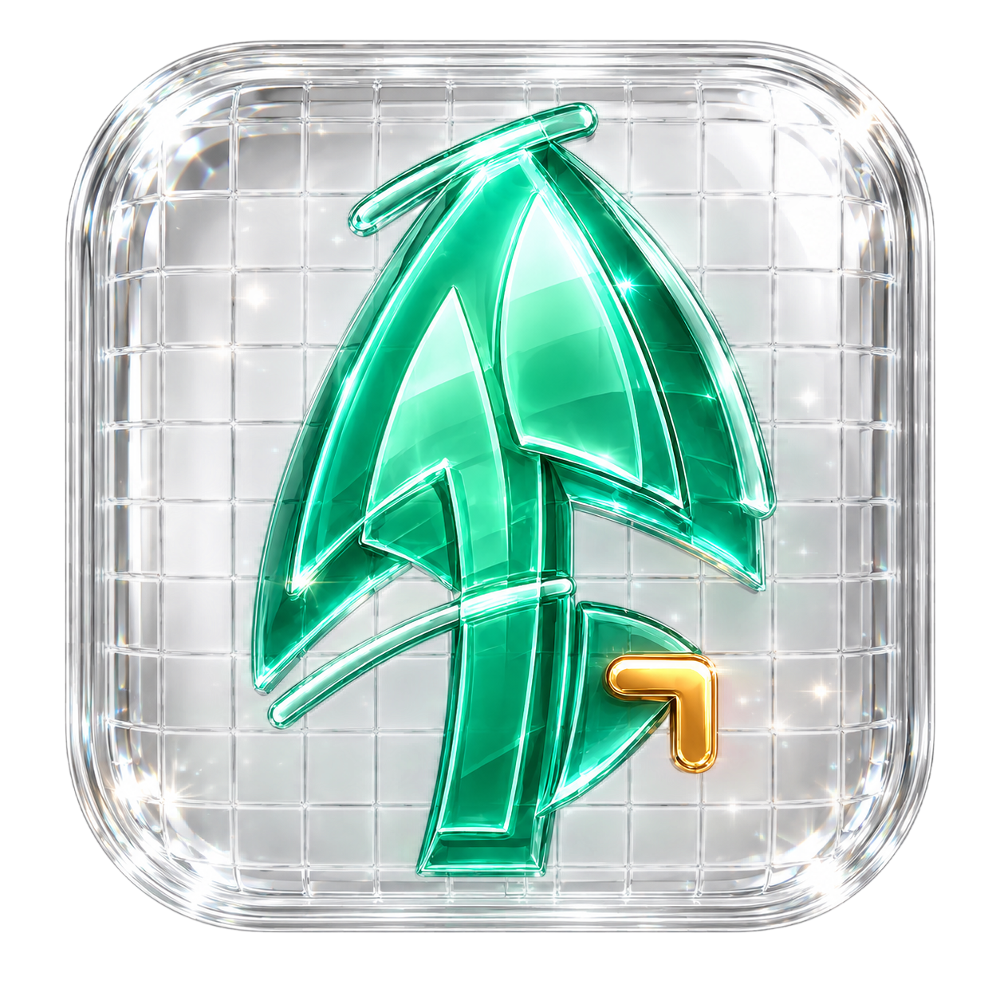

<p align="center">
  
</p>

<h1 align="center">Pines</h1>

<p align="center">
  <strong>A local-first AI workbench for iPhone, iPad, and Apple Watch.</strong>
</p>

<p align="center">
  Run MLX models on device, bring your own cloud providers when a task needs more reach,
  keep private context in an encrypted Vault, and connect tools without hiding the boundary.
</p>

<p align="center">
  <a href="https://github.com/RNT56/pines/actions/workflows/ci.yml"></a>
  <a href="https://github.com/RNT56/pines/actions/workflows/codeql.yml"></a>
  <a href="https://github.com/RNT56/pines/releases"></a>
  
  
  
  <a href="LICENSE"></a>
</p>

<p align="center">
  <a href="https://github.com/topics/local-ai"></a>
  <a href="https://github.com/topics/on-device-ai"></a>
  <a href="https://github.com/topics/mlx-swift"></a>
  <a href="https://github.com/topics/byok"></a>
  <a href="https://github.com/topics/rag"></a>
  <a href="https://github.com/topics/mcp"></a>
  <a href="https://github.com/topics/swiftui"></a>
  <a href="https://github.com/topics/watchos"></a>
</p>

<p align="center">
  <a href="https://pines-ios-ai.netlify.app/">Website</a> ·
  <a href="#product-tour">Product tour</a> ·
  <a href="#your-data-boundary-in-plain-language">Privacy</a> ·
  <a href="#build-from-source">Build</a> ·
  <a href="docs/STATUS.md">Status</a> ·
  <a href="#documentation">Documentation</a> ·
  <a href="https://github.com/RNT56/pines/releases">Releases</a>
</p>

> [!IMPORTANT]
> Pines is a source-available developer preview. There is no public App Store or TestFlight build today. The current GitHub release contains source/developer-preview artifacts, while production distribution still depends on signed release automation, final device acceptance, and App Store privacy review. See [current status](docs/STATUS.md) and [releases](https://github.com/RNT56/pines/releases).

## The AI workbench you own

Modern AI work rarely fits inside one model or one vendor. A private note may belong with a small local model. A difficult research task may benefit from a cloud specialist. A project may need durable context, a browser, an MCP server, generated media, or an Apple Watch reply without turning into a maze of apps and dashboards.

Pines brings those pieces into one calm mobile workspace. Local inference is a real first-class route. Cloud access is bring-your-own-key and explicit. Private material has a home before it has a destination. Tools expose their authority before they act.

Pines never silently turns a local request into a cloud request. You choose the model, the route, the context, and the tools.

## What makes Pines different

| Principle | What it means in practice |
| --- | --- |
| **Local is a real route** | Discover, install, and run supported MLX language, vision, and embedding models on device with memory, thermal, and compatibility guardrails. |
| **Cloud is optional** | Add OpenAI, OpenAI-compatible endpoints, OpenRouter, Anthropic, Gemini, or Voyage AI with your own credentials only when your workflow needs them. |
| **Context has a home** | Keep documents, notes, images, chunks, OCR, embeddings, and retrieval inside an encrypted local Vault instead of repeatedly pasting them into chats. |
| **Consent is visible** | Private Vault or MCP context requires approval before cloud use, and high-impact provider tools expose data egress, side effects, and destinations. |
| **Provider resources stay distinct** | Cloud files, vector stores, caches, batches, research runs, live sessions, and generated media are labeled separately from local Vault data. |
| **Mobile is the product** | The iPhone and iPad app, Watch companion, Live Activities, haptics, responsive layouts, and performance instrumentation are designed as one Apple-platform experience. |

## Product tour

| Surface | What you can do |
| --- | --- |
| **Chats** | Choose a model per conversation, stream responses, attach images, PDFs, and text-like files, edit or regenerate messages, stop and retry runs, and inspect citations, hosted tools, provider files, usage, and route receipts. |
| **Models** | Search Hugging Face, review capability and device-fit information, install or resume downloads, inspect runtime admission and compatibility, and keep local model state visible. |
| **Vault and Project Spaces** | Import PDFs, images, Markdown, JSON, CSV, and plain text; run OCR, chunking, full-text and vector retrieval; and organize reusable context for related chats. |
| **Artifacts** | Find images, video, speech, and research reports in a responsive gallery with search, filters, Quick Look, focused creation workspaces, progress, and provenance. |
| **Tools and agents** | Use typed, policy-gated calculator, date/time, attachment, Vault, conversation, Brave Search, web-fetch, and browser tools with audit events and approval boundaries. |
| **MCP** | Connect Streamable HTTP servers for tools, resources, prompts, subscriptions, OAuth PKCE, and user-reviewed sampling without granting invisible authority. |
| **Cloud resources** | Manage provider-hosted files, vector stores, caches, batches, research jobs, generated media, and live or realtime session records without confusing them with local data. |
| **Settings** | Configure providers, MCP servers, privacy, app lock, optional CloudKit sync, themes, local runtime behavior, diagnostics, and data controls from focused settings pages. |
| **Watch and Live Activities** | List and open conversations, send quick replies, stop active runs, retry pending requests, manage chats from Apple Watch, and follow model downloads through Live Activities. |

Explore the interactive [Pines product tour](https://pines-ios-ai.netlify.app/#tour), the [Artifact Desk](docs/ARTIFACT-DESK.md), or the complete [implementation status](docs/STATUS.md).

## Local first, cloud when it earns the trip

Pines is designed around choosing the right intelligence for the moment rather than committing every task to one provider.

| Route | Role in Pines |
| --- | --- |
| **On-device MLX** | Local language, vision, and embedding models; Hugging Face discovery; resumable installs; runtime admission; memory and thermal guardrails. |
| **OpenAI** | Responses-based chat and reasoning, web search, attachments, files, vector stores, batches, Deep Research, realtime records, and generated image, video, and audio artifacts. |
| **OpenAI-compatible** | Configurable compatible endpoints for model discovery, streaming inference, tools, and embeddings where the endpoint supports them. |
| **OpenRouter** | Expert routing controls, upstream provider preferences, structured responses, bounded server web search, fallback visibility, usage, and privacy-minimized cost receipts. |
| **Anthropic** | Claude Messages, thinking controls, prompt caching, citations, files, web search and fetch, token counting, batches, and hosted-tool provenance. |
| **Gemini** | Generate Content and Interactions, Google Search grounding, URL context, Files, context caches, Live records, Deep Research, media generation, batches, and token counting. |
| **Voyage AI** | Embedding-focused provider configuration for semantic Vault indexing where a dedicated retrieval route is preferred. |

Provider features vary by API, model, region, account, and provider policy. Pines keeps those capabilities explicit instead of pretending every endpoint is interchangeable. See the [cloud-provider documentation](docs/cloud-providers/README.md).

## Your data boundary, in plain language

- **Local by default.** Chats, local model state, Vault documents, local embeddings, attachments, and normal local inference stay on device unless you choose another route.
- **Secrets belong in Keychain.** API keys, OAuth tokens, bearer tokens, and secret-like headers are not stored in the app database, CloudKit records, logs, or audit payloads.
- **Private context requires a decision.** Vault and selected MCP resource context need per-turn approval before they can be sent to a BYOK provider.
- **Cloud storage is labeled as cloud storage.** Provider-hosted files, caches, batches, research jobs, and artifacts remain subject to the provider retention and billing rules.
- **Sync is optional.** CloudKit uses the private database only after opt-in; secrets and model binaries are excluded, and personal-team builds keep iCloud entitlements disabled by default.
- **App lock is optional.** Face ID can protect the app, with a privacy cover while Pines is inactive or backgrounded.
- **No tracking by default.** The committed privacy manifest declares no tracking and CI checks the required-reason API declarations.

Read the [security model](docs/SECURITY.md), [App Store privacy notes](docs/APP_STORE_PRIVACY.md), and [MCP trust boundaries](docs/MCP.md) before connecting external systems.

## Current availability

| Item | Current state |
| --- | --- |
| **Distribution** | Source/developer preview. No signed public TestFlight or App Store build yet. |
| **Latest tagged preview** | [`v0.1.0`](https://github.com/RNT56/pines/releases/tag/v0.1.0), published as a source archive, checksum, and validation logs rather than an unsigned IPA. |
| **Platforms** | iPhone and iPad on iOS/iPadOS 17 or newer; Apple Watch companion on watchOS 10 or newer. |
| **Local runtime** | Implemented and actively hardened. Exact model, mode, and device acceptance evidence is still required before Pines presents combinations as `Verified` or `Certified`. |
| **Cloud providers** | BYOK provider configuration, streaming, lifecycle records, provenance, and provider-specific features are implemented; API capabilities and cost coverage still vary. |
| **Sync** | Optional private CloudKit sync. Personal-team source builds keep CloudKit off unless a paid-team build explicitly enables the required entitlements. |
| **License** | Source-available for noncommercial use under PolyForm Noncommercial 1.0.0. Commercial use requires a separate written license. |

The detailed readiness boundary lives in [`docs/STATUS.md`](docs/STATUS.md). Performance acceptance and physical-device evidence are tracked in the [performance runbook](docs/performance/RUNBOOK.md).

## Build from source

### Requirements

- macOS with a full Xcode installation. The maintained release-validation path uses Xcode 26 with iOS and watchOS platform support.
- Git and an internet connection for the first package and tool download.
- iOS/iPadOS 17 or newer for the app; watchOS 10 or newer for the optional companion.
- An Apple development team and unique bundle identifiers when deploying to physical devices.
- A real device with enough available memory for the local model you choose. The simulator is useful for UI and integration work, not representative local-model performance.

### Clone and generate the project

```sh
git clone https://github.com/RNT56/pines.git
cd pines
bash scripts/ci/xcodegen.sh generate
open Pines.xcodeproj
```

The generator wrapper downloads and verifies the pinned XcodeGen `2.45.4` binary, then regenerates the committed Xcode project from `project.yml`.

In Xcode:

1. Select the `Pines` scheme and an iPhone or iPad destination.
2. Choose your signing team and change bundle identifiers if your account requires unique values.
3. Build and run.
4. Open **Models** to choose an on-device model, or open **Settings → Cloud Providers** to add a BYOK route.
5. Add documents in **Vault**, then decide per conversation whether local context may be used by a cloud provider.

Personal Apple Developer teams can build the default app without iCloud entitlements. Enabling CloudKit requires the paid-team configuration described in the [Developer README](DEV_README.md).

### Verify a checkout

```sh
swift build --disable-automatic-resolution
swift test --disable-automatic-resolution
swift run --disable-automatic-resolution PinesCoreTestRunner
bash scripts/ci/check-public-hygiene.sh
```

Full iOS, watchOS, simulator, Release-hygiene, and performance workflows are documented in the [Developer README](DEV_README.md) and [release process](docs/RELEASES.md).

## First useful workflow

1. **Start local.** Install a device-appropriate model from **Models** and open a chat.
2. **Give context a home.** Import notes, PDFs, images, Markdown, JSON, CSV, or text into **Vault**.
3. **Choose the route.** Keep a task local, or add a BYOK provider when it needs more reach.
4. **Approve the boundary.** Decide whether private context can accompany a cloud request.
5. **Add tools deliberately.** Enable built-in tools or connect an MCP server only when the workflow benefits.
6. **Stay close on Watch.** Use the companion for quick replies, status, cancellation, and pending-request recovery.

## Frequently asked questions

<details>
<summary><strong>Does Pines require a cloud provider?</strong></summary>

No. Local execution is a first-class route. Cloud providers are optional and use credentials you add yourself.
</details>

<details>
<summary><strong>Can Pines silently fall back from local to cloud?</strong></summary>

No. Routing policy keeps local and cloud execution explicit. A local request is not silently converted into a cloud request.
</details>

<details>
<summary><strong>Can a cloud provider automatically see my Vault?</strong></summary>

No. Private local context has a visible per-turn approval path before cloud use. You can send without that context or keep the turn local.
</details>

<details>
<summary><strong>Where are provider keys stored?</strong></summary>

Provider credentials and OAuth secrets are stored in Apple Keychain, not in the local SQLite database, CloudKit content, logs, or audit payloads.
</details>

<details>
<summary><strong>Is Pines available in the App Store?</strong></summary>

Not yet. Pines is available as source and developer-preview release artifacts. Public distribution will be announced only after signing, device acceptance, and App Store review are complete.
</details>

<details>
<summary><strong>Is Pines open source?</strong></summary>

Pines is source-available under PolyForm Noncommercial 1.0.0. You may inspect, build, modify, and contribute within that license; commercial use requires separate written permission.
</details>

## Documentation

### Product and trust

- [Product website](https://pines-ios-ai.netlify.app/)
- [Implementation status](docs/STATUS.md)
- [Model notes](models.md)
- [Artifact Desk](docs/ARTIFACT-DESK.md)
- [Cloud providers](docs/cloud-providers/README.md)
- [MCP support](docs/MCP.md)
- [Security and privacy](docs/SECURITY.md)
- [App Store privacy notes](docs/APP_STORE_PRIVACY.md)

### Architecture and development

- [Developer README](DEV_README.md)
- [Architecture](docs/ARCHITECTURE.md)
- [Design system](docs/DESIGN_SYSTEM.md)
- [Performance](docs/performance/README.md)
- [TurboQuant integration](docs/TURBOQUANT.md)
- [Release process](docs/RELEASES.md)
- [Contributing](CONTRIBUTING.md)

## Contributing

Pines is early, broad, and intentionally modular. Contributions should preserve local-first defaults, explicit cloud boundaries, reproducible package pins, architecture ownership, and the existing validation gates. Start with [`CONTRIBUTING.md`](CONTRIBUTING.md) and the [Developer README](DEV_README.md).

## License

Pines is source-available under the [PolyForm Noncommercial License 1.0.0](LICENSE) (`PolyForm-Noncommercial-1.0.0`). Commercial use requires a separate written license from RNT56.

Redistributions must preserve the notices in [NOTICE](NOTICE). Third-party dependencies retain their own licenses; see [THIRD_PARTY_NOTICES.md](THIRD_PARTY_NOTICES.md).

<p align="center">
  Built with SwiftUI, MLX Swift, GRDB, SQLCipher, CloudKit, and MCP.
</p>
