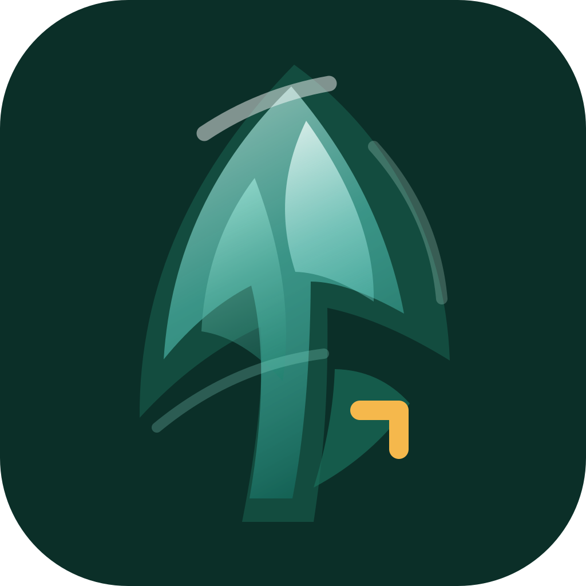

<p align="center">
  
</p>

<h1 align="center">pines</h1>

<p align="center">
  <a href="https://github.com/RNT56/pines/actions/workflows/ci.yml"></a>
  <a href="LICENSE"></a>
</p>

`pines` is an iOS 26-only, local-first AI workbench scaffolded for MLX Swift inference and pinned Schtack-maintained MLX forks.

The repository contains:

- `Pines/`: SwiftUI iOS application shell, design system, app icon assets, runtime bridge points, GRDB store, CloudKit sync, MCP client, and feature views.
- `Sources/PinesCore/`: testable core domain, routing, model catalog, tools, vault, persistence schema, and cloud/BYOK abstractions.
- `Sources/PinesCore/Architecture/`: module ownership and repository contracts for production feature boundaries.
- `Sources/PinesCoreTestRunner/`: framework-free checks for the non-UI production contracts.
- `.github/workflows/`: CI and GitHub Release automation.
- `project.yml`: XcodeGen configuration for the iOS project.
- `Package.resolved`: committed SwiftPM lockfile for the package/test graph. The iOS app MLX fork pins live in `project.yml` as exact revisions.

## Architecture

The app is split into production seams:

- `PinesAppServices` is the composition root for secrets, model catalog, preflight, execution routing, tool policy, redaction, and MLX bridge services.
- `PinesArchitecture.modules` documents feature ownership for Chats, Models, Vault, Agents, and Settings, including database tables and dependencies.
- Repository protocols in `PinesCore` isolate persistence from SwiftUI and let GRDB/CloudKit implementations replace seed data without changing views.
- Agent/cloud routing remains explicit: cloud execution is opt-in through `AgentPolicy` and is never a silent fallback.
- App-level implementation files are split by concern: app model DTOs live in `PinesAppModelTypes.swift`, CloudKit persistence merge logic lives in `GRDBPinesStore+CloudKit.swift`, design components live in `PinesDesignComponents.swift`, MCP wire payloads live in `MCPStreamableHTTPPayloads.swift`, model download support lives in `ModelDownloadSupport.swift`, and MLX compatibility models are split by model family.
- TurboQuant is the requested default local KV-cache strategy. Pine requests the paper-exact Metal backend, reports native Metal codec and compressed-attention availability, falls back to MLX packed attention when needed, and stores compressed vault embeddings locally for approximate search plus FP16 rerank. Runtime defaults adapt to iOS memory/thermal state, including compact 6 GB device guardrails. See `docs/TURBOQUANT.md`.

## MLX Fork Pins

The iOS app links the maintained MLX forks through `project.yml` and the generated Xcode project:

- `MLXSwift`: `https://github.com/RNT56/mlx-swift` at `dd13c2b55a743473d458058e9d9fb028233065ec`
- `MLXSwiftLM`: `https://github.com/RNT56/mlx-swift-lm` at `4bb7cbc6aafdf6abec4c34bf36f9e649444539f7`

These pins are intentional because the app consumes additive TurboQuant and compatibility APIs that are not assumed to exist in upstream package releases yet.

## Design System

`PinesDesignSystem.swift` defines theme tokens and environment plumbing. `PinesDesignComponents.swift` contains reusable SwiftUI components and modifiers.

- User-selectable templates: Evergreen, Graphite, Aurora, Paper, Slate, Porcelain, Sunset, and Obsidian.
- Interface modes: System, Light, and Dark.
- Semantic colors, typography, spacing, radii, strokes, shadows, materials, and motion curves.
- Environment injection through `\.pinesTheme`, so every screen inherits the selected template.
- Settings includes live template previews and mode selection.

Generate the Xcode project:

```sh
xcodegen generate
```

The generated app target is personal Apple Developer account safe by default:
`PINES_CODE_SIGN_ENTITLEMENTS` and `PINES_ICLOUD_SWIFT_FLAGS` are empty, so
Xcode does not request iCloud provisioning. Paid-team CloudKit builds must
override both settings together:

```sh
xcodebuild \
  -project Pines.xcodeproj \
  -scheme Pines \
  PINES_CODE_SIGN_ENTITLEMENTS=Pines/Pines.entitlements \
  PINES_ICLOUD_SWIFT_FLAGS="-D PINES_CLOUDKIT_ENABLED" \
  build
```

Run available local core checks:

```sh
swift test
swift run PinesCoreTestRunner
```

The repository keeps `PinesCoreTestRunner` as a framework-light smoke runner for CI and constrained developer environments. Full iOS compilation requires a full Xcode install selected via `xcode-select`.

## CI And Releases

CI runs on pull requests, pushes to `main`, and manual dispatch. It performs public-repo hygiene checks, builds the Swift package, runs `swift test`, runs `PinesCoreTestRunner`, regenerates the Xcode project, and builds the iOS app without signing on the `macos-26` runner.

GitHub Releases are tag-driven. Push a semantic tag such as `v0.1.0` to run release validation and publish a source/developer-preview release with checksums:

```sh
git tag v0.1.0
git push origin v0.1.0
```

See:

- `docs/ARCHITECTURE.md`
- `docs/DESIGN_SYSTEM.md`
- `docs/SECURITY.md`
- `docs/STATUS.md`
- `docs/RELEASES.md`

## License

Pines is source-available under the [PolyForm Noncommercial License 1.0.0](LICENSE) (`PolyForm-Noncommercial-1.0.0`). You may use, modify, and redistribute this repository only for permitted noncommercial purposes under that license. Commercial use requires a separate written license from Schtack.

Redistributions must preserve the required notices in [NOTICE](NOTICE). Third-party dependencies keep their own licenses; see [THIRD_PARTY_NOTICES.md](THIRD_PARTY_NOTICES.md).
