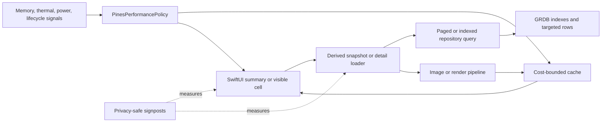

# Performance Architecture

## Invariants

1. SwiftUI `body` code may select and format already-derived values; it must not perform filesystem reads, image decompression, JSON parsing, hashing of large payloads, database joins, or network work.
2. List state contains summaries. Large bytes, chunk bodies, embeddings, and full provider objects belong in targeted detail state with explicit eviction.
3. A mutable operation uses a stable identity. Status timestamps and filter queries must not restart its polling loop; a changed provider-side operation identifier must restart it so polling follows the new remote operation.
4. One operation has at most one polling task and one network request in flight. Cancellation must end sleeping and in-flight work.
5. Caches are keyed by content identity plus every rendering dimension that changes output, have a cost/count bound, coalesce duplicate work, and purge on pressure.
6. Repository list APIs are paged or capped and have indexes matching their ordering. Detail APIs fetch by primary identity.
7. A single-domain mutation must not re-read unrelated provider lifecycle tables. Full refresh is reserved for bootstrap, recovery, and explicit reconciliation.
8. Provider and file work initiated by the main-actor app model crosses into an actor or asynchronous service before touching disk or decoding bytes.
9. Release profiling uses the shipping dependency graph and Release optimization settings. Coverage and diagnostic helper linkage are prohibited.
10. Metrics record durations, counts, categories, and bounded byte totals only. Prompts, filenames, provider payloads, document text, and identifiers are not metric payloads.

## Data Flow

## Feature Notes

### Artifacts

Artifact records are joined to provider and research metadata through prebuilt dictionaries. Derived library snapshots are computed outside view bodies, and search work is cancellable and debounced. Activity polling is independent of gallery filters. Thumbnails request target-sized `CGImage` output; embedded base64 is decoded only after a cache miss.

### Providers and transfers

Provider lifecycle state is one atomic snapshot so observers do not render nine partial states. Bootstrap loads independent domains concurrently with a generation guard and SQL-level retained-row caps backed by ordering indexes. Detail and cursor APIs avoid loading entire tables. Local files are staged with cancellable chunked copies outside the main actor; network upload bodies are file-backed and streamed for large sources. A lock-protected progress gate prevents transport callbacks from flooding the main actor, and persistence remains throttled.

### Vault

Vault rows retain scalar metadata only. Selection starts a generation-guarded detail load for the first chunk page, SQL aggregate counts, and a bounded source preview. Oversized encrypted sources are rejected by file-size preflight before whole-file decryption. The detail payload is cleared on navigation, backgrounding, memory pressure, or selection change. Embedding counts use SQL `COUNT`, and export byte counts use a SQL byte aggregate rather than loading every chunk.

### Chats

Opening a thread does not force a duplicate reload. Markdown and syntax work is actor-isolated and cached by content. Web-citation JSON decoding is asynchronous. WKWebView content is reloaded only when its HTML changes. Cache eviction is cost based and responds to memory pressure.

## Review Checklist

- Does a new list load unbounded rows or bytes?
- Is an async task keyed by mutable display state?
- Can two pollers or refresh generations overlap?
- Does any view initializer or computed property read a file, parse JSON, hash content, or decompress an image?
- Is the cache key complete, and is the cache bounded by cost?
- Does the relevant database ordering have an index and deterministic tie-breaker?
- Can Low Power Mode, thermal pressure, reduced motion, backgrounding, and memory warnings stop optional work?
- Is the metric privacy-safe and useful for a before/after trace?
- Was the change tested in `PinesPerformance`, not only a Debug/coverage build?
